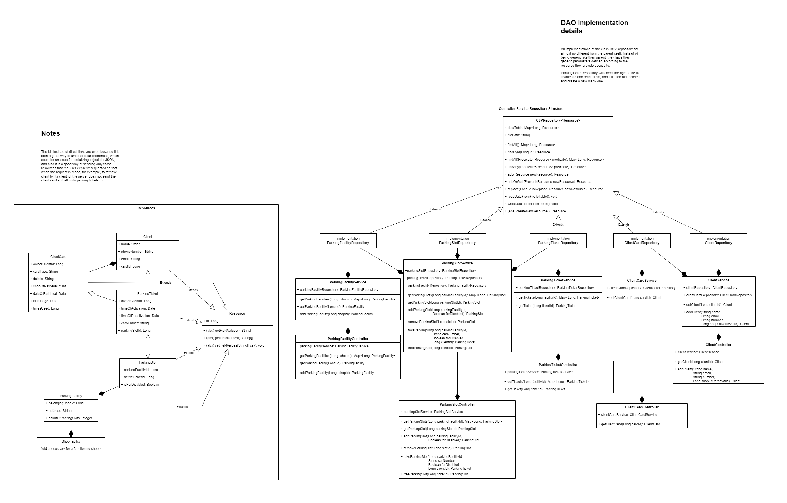

# ParkingAPI
 
This repository is an API that you can manage parking facilities with. It can add, remove, book and free parking slots, assign them to different parking facilities, and those facilities to shops. It can manage clients, and track who parkend where and when. For that, it uses REST as a means of communication and Controller-Service-Repository model, and CSV as a means of storage.

# The task

The task was to create an API that can provide and exchange information about parking slots: address, shop, count of parking places, information about filled places, the duration of the usage of a parking place (the time of activation and deactivation), parking tickets, information about common customer cards. It should have been implemented using REST and CRUD, while using Controller-Service-Repository project structure. All data about entities should have been saved in .csv format, and periodically (once every month for full reset, once every day for new file) refreshed.

# The Structure

Here, you can see the class diagram of the project:

The most important part of the project is its CSV repository - a class that is responsible for reading and writing the csv data and map it to the objects in the program. It creates all the stored csv files in folders with a name representing the table contents. Inside them is another level of folders, but with days representing year and month at which the file was created, like `2019_Jun`. The csv files inside are named according to the date they were created at, like `2019_06_05.csv`.

When the program starts, it searches for the folder `data`. If no such folder exists, it creates one, and fills it with the csv files in a folder structure described above. Every write requests triggers a save operation that saves the changes to the latest created file.

The other parts of the project use and adopt the functionality of CSVReader. REST controllers are used to access data through the web. All the details about the structure can be seen on the diagram above.

# How to run

To run the app, you need Java 17 and Maven. Open command line in a directory where the project is stored, then run `mvn clean package`. After that, go to the newly generated `target` directory, and run `java -jar ParkingAPI-1.0-SNAPSHOT.jar`. The server should start in the command line window. You can now access the server from browser.

# Available Requests

1. `GET`:`http://{ip}:{port}/clients/{clientId}` - Get client by id;
2. `POST`:`http://{ip}:{port}/shops/{shopId}/clients/add/{name}?phone={required}&email={default:null}` - Add new client. Shop id is used to determine where the client was registered;

3. `GET`:`http://{ip}:{port}/client-cards/{cardId}` - Get client card by its id;

4. `GET`:`http://{ip}:{port}/parking-facilities/{facilityId}` - Get parking facility by id;
5. `POST`:`http://{ip}:{port}/shops/{shopId}/parking-facilities/add?address={required}` - Add a new parking facility to the shop;

6. `GET`:`http://{ip}:{port}/parking-facilities/{parkingFacilityId}/parking-slots` - Get all parking slots of the parking facility;
7. `GET`:`http://{ip}:{port}/parking-slots/{parkingSlotId}` - Get parking slot by its id;
8. `POST`:`http://{ip}:{port}/parking-facilities/{parkingFacilityId}/parking-slots/add?forDisabled={default:false}` - Add a new parking slot
9. `DELETE`:`http://{ip}:{port}/parking-slots/{parkingSlotId}/remove` -  Remove parking slot by its id;
10. `PUT`:`http://{ip}:{port}/parking-facilities/{parkingFacilityId}/take-slot/{carNumber}?forDisabled={default:false}&clientId={default:0}` -  Take parking slot;
11. `PUT`:`http://{ip}:{port}/parking-tickets/{ticketId}/free` -  Free parking slot

12. `GET`:`http://{ip}:{port}/parking-facilities/{facilityId}/parking-tickets` - Get all parking tickets of this parking facility;
13. `GET`:`http://{ip}:{port}/parking-tickets/{ticketId}` -  Get parking ticket by its id;

To test the program, it is suggested to use the combination `5`-`8`(x5)-`2` and then try and take the parking slot using `10`. Then you can check if the received ticket was stored using `12` and `13`. After that, try and free the slot using `11`.
